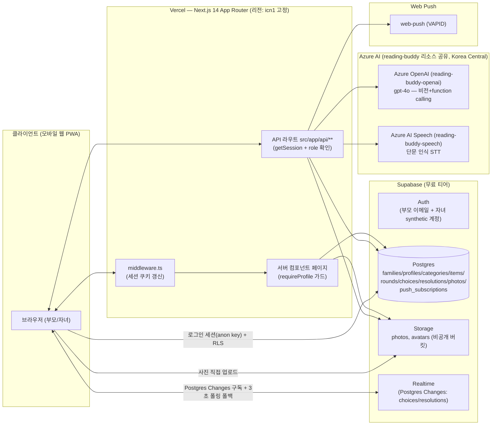

# 아키텍처 문서 — 따로 또 같이

**문서 버전:** v1.0
**작성일:** 2026-09-13
**성격:** **실제 구현(as-built) 기준** 기술 참조 문서. [PRD.md](PRD.md)는 개발 착수 전 계획이며, 실제로는 일부 다르게 구현됐다(예: 사진 매칭 방식, 실시간 동기화 프로토콜, AI 제공사) — 이 문서가 코드베이스와 어긋나면 **이 문서를 코드에 맞춰 갱신**할 것.

---

## 1. 개요

twin-choice는 **Next.js 14(App Router) 단일 애플리케이션**으로, 프론트엔드·API 라우트·인증 미들웨어가 하나의 저장소·하나의 Vercel 배포에 통합돼 있다. 데이터/인증/파일 저장/실시간 동기화는 **Supabase**, AI 기능(사진 라벨링·비교·관찰 요약·음성 인식)은 **Azure AI 서비스**(자매 프로젝트 reading-buddy와 리소스 공유), 푸시 알림은 **Web Push(VAPID)**를 쓴다. 별도 백엔드 서버나 서버리스 함수 플랫폼(Azure Functions 등)은 없다.



---

## 2. 기술 스택

| 영역 | 기술 | 비고 |
|---|---|---|
| 프론트엔드 프레임워크 | Next.js 14.2.35 (App Router) | 서버 컴포넌트 위주, 클라이언트 컴포넌트는 폼/대화형/실시간 UI에 한정 |
| UI | React 18 + Tailwind CSS | 차트도 별도 라이브러리 없이 순수 SVG로 구현(§6). 파스텔 블록 카드 + 검은 선(`border-2 border-ink`) 디자인 시스템 |
| 폰트 | Google Fonts `Jua`(타이틀) + `Gothic A1`(본문) | `next/font/google` 대신 CSS2 API `<link>` 사용 — 한글 subset을 브라우저가 알아서 필요한 만큼만 받아옴 |
| 언어 | TypeScript | `tsc --noEmit`로 타입 검사 |
| DB/Auth/Storage/Realtime | Supabase (`@supabase/supabase-js`, `@supabase/ssr`) | Postgres, RLS 전면 활성화 |
| AI SDK | `openai` npm 패키지 | Azure OpenAI를 OpenAI 호환 엔드포인트로 호출(`AzureOpenAI` 클래스) |
| 음성 인식 | Azure AI Speech REST API | `fetch`로 직접 호출(SDK 미사용) |
| 푸시 알림 | `web-push` | VAPID 키 쌍, 서비스 롤로 발송 |
| 비밀번호 해시 | `bcryptjs` | 자녀 PIN 표시/대조용 해시(인증에는 안 씀, §4 참고) |
| 테스트 | Vitest 2.1.9 | 순수 함수 단위 테스트 25개(`npm run test`, §9 참고) |
| 배포 | Vercel (Hobby) | `vercel.json`에 `regions: ["icn1"]` 고정 |

---

## 3. 디렉터리 구조 (핵심만)

```
src/
  middleware.ts                  # 모든 요청에서 Supabase 세션 쿠키 갱신(getUser() 1회)
  lib/
    supabase/                    # client.ts(브라우저) / server.ts(RSC) / admin.ts(service role, RLS 우회)
    currentProfile.ts            # getSession() 기반 현재 프로필 조회, requireProfile()
    childAuth.ts                 # PIN 검증/잠금 판정, synthetic 계정 비밀번호 파생
    joinCode.ts                  # 가족 코드 생성
    concessionStats.ts           # 양보 지수 집계(주간 버킷)
    observationSafety.ts         # AI 출력 금지어 필터
    azureOpenAI.ts               # describePhoto / compareChoices / generateObservationSummary /
                                  # generateStartPrioritySuggestion
    azureSpeech.ts                # 음성 인식(Azure AI Speech REST)
    pcmRecorder.ts                # 브라우저 마이크 → 16kHz mono WAV 인코딩(클라이언트)
    imageResize.ts                # 사진 업로드 전 축소+재압축(클라이언트)
    webpush.ts / pushClient.ts    # Web Push 발송(서버) / 구독(클라이언트)
    tilePalette.ts                # 카테고리/항목 타일 색상 순환 배정
    defaultCategories.ts          # 회원가입 시 기본 카테고리 시딩
    types.ts                     # 테이블 타입
    *.test.ts                    # Vitest 유닛 테스트(순수 함수만)
  components/
    RoundView.tsx                 # 블라인드 선택/공개/조율/사진으로 고르기/음성 이유 — 가장 큰 컴포넌트
    CategoryPicker.tsx            # 카테고리 선택 → 라운드 생성/합류
    HistoryView.tsx / PrioritySuggestion.tsx  # 기록(자녀/부모 공용)
    ObservationReport.tsx         # AI 관찰 요약(부모 전용, `/settings/dashboard`에서만 마운트)
    ConcessionChart.tsx           # 양보 지수 주간 추이 SVG 차트
    CategoriesManager.tsx / ItemsManager.tsx / ChildrenManager.tsx / PhotoArchive.tsx  # 부모 설정 화면
    VoiceReasonRecorder.tsx       # "왜 이게 좋아?" 음성 녹음
    PushNotificationToggle.tsx / ServiceWorkerRegister.tsx
    Avatar.tsx / Topbar.tsx / NavBar.tsx / LogoutButton.tsx / icons.tsx
  app/
    (auth)                        /login, /login/parent, /login/child, /signup
    home/                          자녀·부모 공용 홈
    round/new, round/[id]          카테고리 선택 → 라운드
    history/                       기록(자녀/부모 공용)
    settings/                      부모 전용 허브 — children/categories/photos/dashboard
    demo/                          해커톤 심사용 데모 안내(제품 기능 아님)
    api/                           Next.js API 라우트로 통일된 백엔드
      auth/                        signup, login, logout, family-lookup, child-login
      children/                    자녀 프로필 CRUD(부모 전용)
      rounds/[id]/                 classify-photo, compare, transcribe-reason
      dashboard/observation-report
      history/priority-suggestion
      push/                        subscribe, unsubscribe, notify
supabase/
  migrations/                     SQL 마이그레이션(0001~0013, 번호 순서대로 SQL Editor 수동 실행)
docs/
  PRD.md / BRIEF.md / STORIES.md / ARCHITECTURE.md (이 문서)
scripts/
  seed-demo-family.ts             # 해커톤 데모 가족 시딩(독립 실행, src/lib import 안 함 — §8 참고)
```

---

## 4. 인증 구조

Supabase Auth로 로그인하는 건 **부모뿐**이다. 자녀는 부모가 만들어준 프로필(이름+아바타+PIN)로 "전환"하지만, 내부적으로는 `child+{profileId}@child.twin-choice.internal` 형태의 **synthetic 계정으로 실제 Supabase Auth 세션**을 발급받는다(`src/lib/childAuth.ts`).

- **PIN → 비밀번호 파생**: PIN 자체를 Supabase Auth 비밀번호로 쓰지 않는다(4자리는 너무 짧다). `HMAC-SHA256(CHILD_AUTH_SECRET, "{profileId}:{pin}")`로 매번 동일하게 재현 가능한 고강도 비밀번호를 만들어 로그인/계정 생성 양쪽에서 사용한다.
- **role 판별**: JWT 클레임이 아니라 `profiles.role` 컬럼(`parent`|`child`)으로 판별. 부모 전용 컴포넌트는 자녀 role일 때 트리에서 아예 마운트되지 않는다(조건부 `display:none`이 아님).
- **PIN 브루트포스 방지**: `profiles.pin_fail_count`/`pin_locked_until`(`0013_pin_lockout.sql`) — 5회 연속 실패 시 1분 잠금.
- **`pin_hash`의 용도**: 인증에는 쓰이지 않는다. bcrypt 해시로 별도 저장해 "PIN을 잊었어요" 같은 대조용으로만 존재(구현 완료는 아니고 필드만 준비됨).
- **세션 검증 흐름**: `middleware.ts`가 모든 요청에서 `supabase.auth.getUser()`로 세션을 검증/갱신(쿠키 갱신 포함, 요청을 막지는 않음 — 실제 접근 제어는 RLS와 각 페이지/라우트의 역할 확인이 담당). 그 뒤 `getCurrentProfile()`과 API 라우트들은 **로컬 `getSession()`**으로 사용자를 읽는다 — 미들웨어가 이미 검증했으므로 Auth 서버에 다시 왕복할 필요가 없다(2026-09-13, reading-buddy에서 발견된 패턴 역이식).
- **로그인 실행 자체(`/api/auth/child-login`)**는 예외**다 — 이건 "이미 검증된 세션을 읽는" 게 아니라 "새로 인증을 시도하는" 것이라 `signInWithPassword`를 직접 호출한다.

---

## 5. 데이터 모델

```sql
families(id, name, created_at)
profiles(id, family_id, role[parent|child], name, avatar, avatar_photo_path[nullable],
         pin_hash, pin_fail_count, pin_locked_until, created_at)
categories(id, family_id, name, emoji, is_active)
items(id, category_id, name, emoji, is_active)
rounds(id, family_id, category_id, started_by, status[waiting|revealed|resolved],
       expected_participants, ai_matched[nullable bool], created_at)
choices(id, round_id, profile_id, item_id[nullable], label[nullable], photo_id[nullable],
        reason[nullable], submitted_at)
resolutions(id, round_id, type[roulette|turn|both|manual|match], winner_profile_id,
            conceded_profile_id, resolved_at)
photos(id, family_id, profile_id, round_id, item_id, storage_path, ai_category, ai_label,
       confirmed, created_at)
push_subscriptions(id, family_id, profile_id, endpoint[unique], p256dh, auth, created_at)
```

**소프트 삭제**: 카테고리/항목은 `is_active=false`로만 숨긴다 — 과거 라운드가 참조하는 `category_id`/`item_id`가 깨지지 않게 하기 위함.

**`choices.item_id`/`label` 중 최소 하나는 필수**: 그리드 선택은 `item_id`, 사진/자유 입력 선택은 `label`(+선택적 `photo_id`)을 쓴다. `rounds.ai_matched`는 공개 시점 AI 비교 결과의 캐시 — 그리드끼리만이면 계산 자체가 필요 없어 `null`로 남고, 사진이 끼면 AI 비교 후 `true`/`false`로 고정된다.

**Storage 경로 규칙**:
- `photos` 버킷(비공개): `{family_id}/{profile_id}/{round_id}-{timestamp}.ext`
- `avatars` 버킷(비공개): `{family_id}/{profile_id}.jpg` — 프로필당 한 장, 재업로드 시 upsert

---

## 6. RLS 정책 요약

| 테이블 | SELECT | INSERT/UPDATE |
|---|---|---|
| `profiles` | 같은 `family_id`만 | 자기 자신 + 부모가 자녀 `avatar`/`avatar_photo_path`만(컬럼 단위 GRANT로 `role`/`pin_hash`/`family_id`는 못 바꾸게 좁힘) |
| `categories`/`items` | 가족 구성원 누구나 | `role='parent'` + family 스코프만(자녀는 SELECT만) |
| `rounds`/`choices` | 같은 family, **단 블라인드 유지**(상대가 제출하기 전엔 상대 row 자체가 안 보임) | 본인 것만 INSERT, `choices.reason`만 본인 소유 한해 UPDATE 가능(컬럼 GRANT로 `item_id`/`label`/`photo_id`는 제출 후 불변) |
| `photos` | `choices`와 동일한 블라인드 규칙 — 라운드가 `waiting`을 벗어난 뒤에만 상대 사진이 보임 | 라벨 수정(UPDATE)은 `role='parent'`만 |
| `resolutions` | 가족 구성원 누구나(공개 후 승자 확인용) | 서버(조율 확정 로직)에서만 |
| `push_subscriptions` | 본인 것만(발송은 서버 서비스 롤이 대상 조회) | 본인 것만 |

**양보 지수·AI 관찰 요약 집계는 RLS로 못 숨긴다**(행 단위 정책은 "누구 row인가"만 가릴 수 있고 "여러 row를 GROUP BY한 결과"는 못 가림) — 그래서 이 집계는 반드시 `role='parent'`를 확인하는 **서버 코드**(서버 컴포넌트 또는 API 라우트)에서 계산하고, 클라이언트는 계산된 결과만 받는다. 자녀도 `resolutions` 개별 row는 RLS상 읽을 수 있지만(게임 진행상 "누가 이겼는지"는 봐야 함), 집계·AI 호출은 전부 서버 게이트를 거친다.

**RLS로 새는 사고가 났던 사례**: family 스코프만 걸고 라운드 상태를 안 보면 "사진으로 고르기" 사용 시 블라인드가 새는 문제가 있었다(`0005_freeform_photo_choices.sql`에서 수정).

---

## 7. AI 통합

### 7.1 리소스 구성 (2026-09-13 기준, reading-buddy와 공유)

원래 twin-choice 전용 Azure OpenAI 리소스("twin")가 있었으나 **삭제되어**(원인 불명, 사용자가 삭제한 것으로 추정), 자매 프로젝트 reading-buddy의 기존 리소스를 재사용하도록 전환했다.

| 용도 | 리소스 | 모델/배포 | 환경변수 |
|---|---|---|---|
| 사진 라벨링, AI 비교, 관찰 요약, 우선순위 제안 | `reading-buddy-openai` (Azure OpenAI, Korea Central) | `gpt-4o` (비전+function calling 지원, `max_tokens` 파라미터 허용) | `AZURE_OPENAI_ENDPOINT`/`AZURE_OPENAI_API_KEY`/`AZURE_OPENAI_DEPLOYMENT` |
| "왜 이게 좋아?" 음성 인식 | `reading-buddy-speech` (Azure AI Speech, Korea Central) | 단문 인식 REST API(`ko-KR`) | `AZURE_SPEECH_REGION`/`AZURE_SPEECH_KEY` |

**Whisper를 안 쓰는 이유**: Azure OpenAI의 오디오 계열 모델(Whisper 등)은 텍스트/비전 모델보다 배포 가능 리전이 훨씬 좁아서, 이 프로젝트가 쓰는 리전(Korea Central)에서는 배포 자체가 불가능했다. 새 리전에 별도 리소스를 만드는 대신, reading-buddy가 이미 검증해둔 Azure AI Speech로 대체했다.

**리소스 공유의 트레이드오프**: 두 프로젝트가 같은 Azure 리소스를 쓰므로 한쪽 트래픽이 급증하면 다른 쪽 지연/쿼터에 영향을 줄 수 있다. 개인 프로젝트 두 개 규모에서는 비용 절감이 이 리스크보다 크다고 판단했다.

### 7.2 호출 지점과 안전장치

| 함수 | 호출 시점 | 실패 시 동작 |
|---|---|---|
| `describePhoto` | 자녀가 사진 촬영("사진으로 고르기") | catch해서 confidence=low로 처리 → 사진은 저장, 수동 라벨 입력으로 폴백 |
| `compareChoices` | 라운드 공개 시점(사진/라벨 선택이 하나라도 있을 때만) | catch해서 `matched=false`로 기본 처리(안전한 쪽 — §8 참고) |
| `generateObservationSummary` | 부모가 `/settings/dashboard`에서 버튼 클릭 | catch해서 502 반환("데이터 부족"과 구분되는 별도 에러) |
| `generateStartPrioritySuggestion` | 부모/자녀가 `/history`에서 버튼 클릭 | catch해서 502 반환(위와 동일) |
| `transcribeAudio`(Azure Speech) | 자녀가 음성 녹음 종료 | catch해서 친절한 에러 메시지, 오디오는 어디에도 저장 안 함 |

**자동 호출 절대 금지 원칙**: 위 다섯 곳 모두 사람의 명시적 행동(촬영/공개/버튼 클릭/녹음 종료)이 트리거다. 백그라운드 배치나 스케줄러로 자동 호출하는 곳은 없다.

**AI 관찰 요약/우선순위 제안의 8원칙**(진단적 언어 금지, 디스클레이머 상시 표시, 자녀 비노출, 최소 표본 게이트, pull 방식, 성격 라벨링 금지, 명시적 트리거, 프롬프트+출력 필터 이중 강제)은 `src/lib/observationSafety.ts`(출력 필터)와 `azureOpenAI.ts`의 `CHILD_LANGUAGE_PRINCIPLES`(시스템 프롬프트)에 구현되어 있다. 아동발달 커뮤니케이션 원칙(형제 비교 금지=Faber&Mazlish, 행동과 정체성 분리=Dweck, 제안형 어투=Deci&Ryan)을 프롬프트에 반영했다 — "전문가 AI"라는 라벨은 의도적으로 쓰지 않는다(과장된 권위 부여가 오히려 원칙 위반).

## 8. AI 실패에 대한 방어적 설계 (2026-09-13 추가)

Azure 리소스가 삭제됐던 사고를 진단하는 과정에서, **AI 호출 실패를 전혀 처리하지 않던 진짜 버그**를 발견해 함께 고쳤다:

- `/api/rounds/[id]/compare`가 실패하면 클라이언트의 `matchResult`가 `null`로 영원히 남아 "비교하는 중..." 스피너에서 **재시도 없이 멈추는** 심각한 버그였다(사진/자유 라벨로 고른 라운드의 공개 흐름 자체가 막힘). `matched=false`로 안전하게 기본 처리하도록 수정.
- `classify-photo`도 실패 시 전체 라우트가 크래시했다 — 이제 "confidence 낮음"과 동일하게 취급해 수동 라벨 입력 경로로 자연스럽게 폴백.
- `observation-report`/`priority-suggestion`은 실패와 "데이터 부족"이 뭉뚱그려져서, 실제로는 데이터가 충분한데도 "아직 데이터가 부족해요"라는 잘못된 안내가 뜰 뻔했다 — 502로 구분.
- 네 곳 모두 `console.error`로 실제 에러를 로그에 남기게 했다 — 조용한 catch 때문에 원인 진단에 애먹었던 문제(Whisper 삭제 초기 진단 시 실제로 겪음)가 재발하지 않도록.

**설계 원칙**: AI는 항상 보조 기능이고, AI가 실패해도 핵심 게임 흐름(선택 → 공개 → 조율)은 절대 멈추지 않아야 한다. 이 원칙은 사진 confidence가 낮을 때의 기존 폴백과 동일한 철학이며, 이번에 "AI가 아예 실패했을 때"까지 범위를 넓혀 일관되게 적용했다.

---

## 9. 실시간 동기화

Supabase Realtime의 **Postgres Changes**(`postgres_changes`, Broadcast/Presence 아님)로 `choices`/`resolutions` 테이블 변경을 구독한다(`RoundView.tsx`). 3초 폴링을 폴백으로 병행한다.

**주의**: 테이블을 `supabase_realtime` publication에 명시적으로 추가해야만 이벤트가 온다 — 이걸 빠뜨려서 Realtime이 처음부터 전혀 작동하지 않던 버그가 있었다(`0010_enable_realtime.sql`).

---

## 10. 성능 최적화

- **Vercel 리전 고정**: `vercel.json`의 `regions: ["icn1"]` — Supabase와 다른 리전에서 서버 함수가 실행되면 매 DB 호출마다 지역 간 왕복이 추가된다(reading-buddy가 실측으로 확인한 원인).
- **인증 이중 확인 제거**: §4 참고 — `middleware.ts`가 이미 검증한 세션을 각 페이지/라우트가 로컬 `getSession()`으로 재사용, Auth 서버 왕복을 없앰.
- **낙관적 업데이트**: 항목 탭처럼 실패 가능성이 낮은 제출은 먼저 화면을 넘기고 실패 시 되돌린다(네트워크 왕복 시간만큼 "느리게" 느껴지지 않게).
- **사진 업로드 전 클라이언트 리사이즈**: 폰카메라 원본(수 MB)을 그대로 올리면 Vercel 서버리스 함수의 요청 본문 크기 제한(~4.5MB)에 걸리고 느려진다 — 브라우저에서 최대 1024px로 축소+JPEG 재압축(`src/lib/imageResize.ts`).

---

## 11. 테스트

Vitest로 **외부 의존성이 전혀 없는 순수 함수만** 유닛 테스트한다(Next.js 서버 컴포넌트/API 라우트/RLS 같은 통합 동작은 실제 브라우저 수동 검증으로 대체). 현재 5개 파일 25개 테스트:

- `tilePalette.test.ts` — 타일 색상 인덱스 순환
- `joinCode.test.ts` — 가족 코드 형식/무작위성
- `childAuth.test.ts` — PIN 검증, 비밀번호 파생의 결정론성, 잠금 판정
- `concessionStats.test.ts` — 양보 지수 주간 집계
- `observationSafety.test.ts` — 금지어 필터

`server-only` 패키지는 react-server 조건이 없는 일반 Node 런타임(=vitest)에서 import되면 예외를 던지도록 만들어져 있어서, `vitest.config.mts`가 이 패키지를 빈 스텁(`test/stubs/server-only.ts`)으로 alias해 우회한다(reading-buddy와 동일 패턴).

---

## 12. 알려진 함정 (재발 방지용 기록)

- **Vercel의 "Sensitive" 환경변수는 소유자도 CLI로 다시 못 읽는다.** `vercel env pull`이 값 대신 `[SENSITIVE]` 플레이스홀더를 준다. `CHILD_AUTH_SECRET`을 생성 직후 별도 백업하지 않아 실제로 분실해 재발급한 사고가 있었다(2026-09-13) — 이런 서버 전용 랜덤 시크릿은 생성 즉시 비밀번호 매니저 등에 백업할 것.
- **CHILD_AUTH_SECRET을 바꾸면 이미 만들어진 모든 자녀 계정의 로그인이 한꺼번에 끊긴다** — PIN→비밀번호 파생 결과가 전부 달라지기 때문. 복구하려면 각 자녀의 **현재 PIN**을 알아야 새 비밀번호를 재계산할 수 있다(bcrypt 해시는 역산 불가).
- **Azure OpenAI 오디오 계열 모델(Whisper)은 리전 지원이 텍스트/비전 모델보다 훨씬 좁다** — 배포하려는 리전에서 모델이 아예 안 보이면 리전 문제일 가능성이 높다.
- **마이그레이션은 `supabase db push`가 아니라 전부 SQL Editor 수동 실행으로 적용해왔다** — 새 마이그레이션을 추가하면 사용자가 직접 순서대로 실행해야 실제 DB에 반영된다.
- 사진처럼 큰 base64 페이로드는 Vercel 서버리스 함수의 요청 본문 크기 제한(~4.5MB)에 걸릴 수 있어 클라이언트 리사이즈가 필수다(§10).
